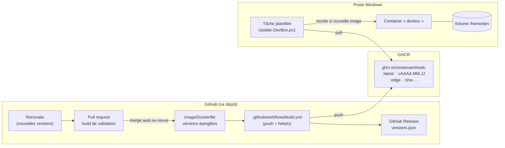
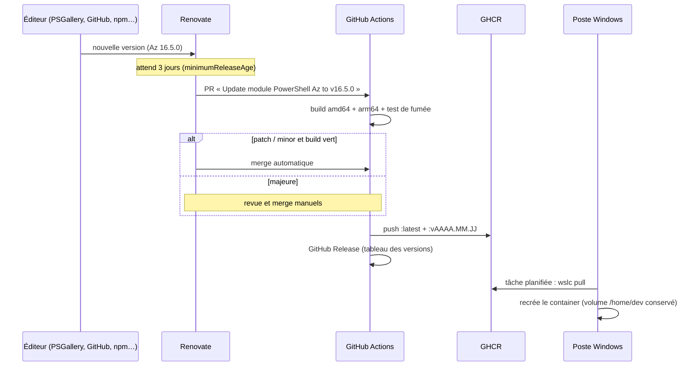

# WSLC — DevBox Azure / Microsoft 365

Définition d'un container **WSL (wslc)** qui remplace une distribution WSL classique pour
l'administration Azure, Microsoft 365 et PowerShell 7. L'image est construite et publiée
par GitHub Actions ; les postes Windows se mettent à jour **automatiquement et en silence**.



## Contenu de l'image

Base **Ubuntu 24.04**, multi-arch **amd64 + arm64**. Les versions des outils sont **épinglées**
dans le [`Dockerfile`](image/Dockerfile) (une ligne `ARG …_VERSION` par outil) et mises à jour par
[Renovate](#versions-des-outils--renovate). La liste exacte des versions est jointe à chaque
[release](../../releases) (`versions.json`) et disponible dans le container via `devbox-versions`.

| Domaine | Outils |
| --- | --- |
| Azure | Azure CLI (`az`), Azure Developer CLI (`azd`), Bicep |
| PowerShell | PowerShell 7 + modules `Az`, `Microsoft.Graph`, `ExchangeOnlineManagement`, `MicrosoftTeams`, `PnP.PowerShell` |
| Microsoft 365 | CLI for Microsoft 365 (`m365`) + Node.js 22 LTS |
| Kubernetes / GitHub | `kubectl`, `helm`, `gh` |
| Base | git, ssh, jq, curl, vim, nano, dig, ping, python3, sudo |

Utilisateur `dev` (uid 1000) avec `sudo` sans mot de passe. Télémétrie des CLI désactivée.

## Structure du dépôt

| Chemin | Rôle |
| --- | --- |
| `image/Dockerfile` | Définition de l'image, versions épinglées |
| `image/build/` | Scripts utilisés pendant le build (installation des modules PowerShell…) |
| `image/rootfs/usr/local/bin/devbox-init` | Point d'entrée : initialise le volume `/home/dev`, fuseau horaire |
| `image/rootfs/usr/local/bin/devbox-versions` | Inventaire JSON des versions (test de fumée en CI) |
| `.github/workflows/build.yml` | Build multi-arch, publication GHCR, release automatique |
| `renovate.json` | Détection des nouvelles versions (outils, modules, actions GitHub, image Ubuntu) |
| `config/devbox.psd1` | Paramètres du container côté Windows |
| `scripts/Install-DevBox.ps1` | Création du container + tâche planifiée + profil Windows Terminal |
| `scripts/Update-DevBox.ps1` | Mise à jour (lancé par la tâche planifiée) |
| `scripts/Enter-DevBox.ps1` | Ouvre un shell dans le container |
| `scripts/Uninstall-DevBox.ps1` | Désinstallation |

## Prérequis

- Windows 11 avec WSL ≥ 3.0 (commande `wslc` disponible) : `wsl --update` puis `wslc version`.
- **Terminal non administrateur.** wslc utilise une session séparée pour les processus élevés
  (`wslc-cli-<user>` vs `wslc-cli-admin-<user>`) : un container créé en admin est invisible
  depuis un terminal normal et depuis la tâche planifiée.
- Mise en place initiale du dépôt GitHub : voir [Première publication](#première-publication).

## Création du container

```powershell
git clone https://github.com/CTroessaert/WSLC.git
cd WSLC
.\scripts\Install-DevBox.ps1
```

Le script (idempotent) :

1. crée le volume `wslc-devbox-home` monté sur `/home/dev` ;
2. télécharge `ghcr.io/ctroessaert/wslc:latest` et crée le container `devbox` ;
3. enregistre la tâche planifiée **`\WSLC\DevBox Update`** (ouverture de session + 5 min, et chaque jour à 12:30) ;
4. ajoute le profil **« DevBox (wslc) »** dans Windows Terminal.

Options : `-NoScheduledTask`, `-NoTerminalProfile`.

### Paramétrage

Modifier `config/devbox.psd1` (commun) ou créer `config/devbox.local.psd1` (propre au poste,
ignoré par git) avec seulement les clés à surcharger, puis appliquer avec
`.\scripts\Update-DevBox.ps1 -Force` :

```powershell
# config/devbox.local.psd1
@{
    Shell       = 'bash'
    Memory      = '8G'
    ExtraMounts = @('C:\Users\chris\repo-sparkxit:/mnt/repos')
}
```

## Utilisation

```powershell
.\scripts\Enter-DevBox.ps1            # shell par défaut (pwsh)
.\scripts\Enter-DevBox.ps1 -Shell bash
```

ou le profil Windows Terminal « DevBox (wslc) ». Le container est démarré automatiquement s'il
est arrêté (après un redémarrage de Windows par exemple). Raccourci possible dans votre profil
PowerShell Windows : `function devbox { & 'C:\…\WSLC\scripts\Enter-DevBox.ps1' @args }`.

### Authentification

Le container n'a pas de navigateur : utilisez le **device code flow** (code à saisir sur
<https://microsoft.com/devicelogin> depuis Windows). Les jetons sont stockés dans `/home/dev`
et survivent donc aux mises à jour.

| Outil | Commande |
| --- | --- |
| Azure CLI | `az login --use-device-code` |
| azd | `azd auth login --use-device-code` |
| Az PowerShell | `Connect-AzAccount -UseDeviceAuthentication` |
| Microsoft Graph | `Connect-MgGraph -UseDeviceCode -Scopes 'User.Read.All'` |
| Exchange Online | `Connect-ExchangeOnline -Device` |
| Teams | `Connect-MicrosoftTeams -UseDeviceAuthentication` |
| PnP PowerShell | `Connect-PnPOnline -Url https://<tenant>.sharepoint.com -DeviceLogin -ClientId <app-id>` |
| CLI for Microsoft 365 | `m365 login` (device code par défaut) |
| GitHub | `gh auth login` puis `gh auth setup-git` |

> Si une stratégie d'accès conditionnel bloque le device code flow, utilisez une identité
> de service (`az login --service-principal`, certificat) ou travaillez depuis Windows.

### Ce qui est conservé lors d'une mise à jour

| Conservé (volume `/home/dev`) | Perdu (recréé depuis l'image) |
| --- | --- |
| `~/.azure`, `~/.ssh`, `~/.gitconfig`, `~/.config`, jetons, repos clonés dans `~`, extensions `az` et modules PowerShell installés en `-Scope CurrentUser` | Paquets ajoutés avec `sudo apt install`, fichiers hors de `/home/dev` |

Un outil manque à tout le monde ? Ajoutez-le au `Dockerfile` (voir [Faire évoluer l'image](#faire-évoluer-limage)).

## Mise à jour automatique

La chaîne complète, de la sortie d'une nouvelle version jusqu'au poste :



### Versions des outils : Renovate

Chaque version d'outil est épinglée dans le `Dockerfile` et précédée d'un commentaire qui indique
à Renovate où chercher les nouvelles versions :

```dockerfile
# renovate: datasource=nuget depName=Az registryUrl=https://www.powershellgallery.com/api/v2/
ARG PSMODULE_AZ_VERSION=16.4.0
```

| Outil | Source suivie par Renovate |
| --- | --- |
| Modules PowerShell (Az, Graph, EXO, Teams, PnP) | PowerShell Gallery (`nuget`) |
| Azure CLI | PyPI `azure-cli` (installé via le dépôt apt Microsoft) |
| PowerShell, Bicep, azd, kubectl, helm, gh | Releases GitHub |
| CLI for Microsoft 365 | npm |
| Node.js | versions LTS uniquement (`node-version`) |
| Actions du workflow, image `ubuntu` | Natif Renovate |

Règles ([`renovate.json`](renovate.json)) :

- une PR par outil, ouverte **3 jours** après la sortie de la version (laisse le temps à l'éditeur de retirer une version cassée) ;
- la PR déclenche le build des deux architectures et le test de fumée `devbox-versions` ;
- **patch / minor** : fusion automatique si le build est vert ;
- **majeure** : label `major`, jamais fusionnée automatiquement. Lire les notes de version jointes à la PR, puis fusionner ;
- **nouvelle LTS Ubuntu** : proposée uniquement en cochant la case dans l'issue *Dependency Dashboard*
  (migration manuelle : paquets `libicu*`, dépôts apt…) ;
- l'issue **Dependency Dashboard** du dépôt récapitule tout : PR ouvertes, en attente, en erreur.

La fusion d'une PR Renovate déclenche le workflow sur `main`, qui publie une release : les postes
se mettent à jour au passage suivant de la tâche planifiée.

### Côté GitHub : build et auto-release

Le workflow [`build.yml`](.github/workflows/build.yml) se déclenche :

| Déclencheur | Cache | Release |
| --- | --- | --- |
| Push sur `main` modifiant `image/**` ou le workflow (dont merge Renovate) | oui | **toujours** |
| Chaque lundi 04:00 UTC (`schedule`) : correctifs de sécurité Ubuntu | non : `apt upgrade` complet | **si un paquet a changé** |
| Manuel (*Actions → Build & release → Run workflow*) | non | si changement, ou case *force_release* |
| Pull request | oui | jamais (build de validation uniquement, rien n'est publié) |

Déroulement :

1. **build** : une image par architecture, sur runners natifs (`ubuntu-24.04` et `ubuntu-24.04-arm`), poussée par digest.
2. **publish** : assemblage du manifest multi-arch, taggé `:edge` et `:sha-<commit>-<run>`.
3. **test de fumée** : `devbox-versions` est exécuté dans l'image ; il échoue si un outil manque, et produit `versions.json`.
4. **comparaison** avec `versions.json` de la dernière release. Le champ `os-packages` est une empreinte de
   tous les paquets apt : un correctif de sécurité Ubuntu déclenche donc aussi une release.
5. **release** si nécessaire : tags `:latest` et `:vAAAA.MM.JJ` (suffixe `.N` si plusieurs le même jour),
   release GitHub avec le tableau des versions (changements en gras) et `versions.json` en pièce jointe.

Sans changement, seul `:edge` bouge : les postes ne sont pas touchés. Le résumé de chaque exécution
(onglet *Actions*) affiche le tableau des versions.

### Côté poste : mise à jour silencieuse

La tâche planifiée lance `Update-DevBox.ps1` à l'ouverture de session (+5 min) et chaque jour
à `UpdateTime`, sans fenêtre (`conhost --headless`). Le script :

1. `wslc pull` de l'image configurée (`:latest`) ;
2. compare l'ID de l'image avec celle du container : identique → rien à faire ;
3. si une session interactive est ouverte dans le container (`SkipUpdateWhenBusy`), reporte au passage suivant ;
4. sinon supprime et recrée le container (le volume `/home/dev` est conservé), puis purge l'ancienne image.

Journal : `%LOCALAPPDATA%\wslc-devbox\devbox.log`.

```powershell
.\scripts\Update-DevBox.ps1              # mise à jour immédiate
.\scripts\Update-DevBox.ps1 -Force       # recrée le container même à jour / session ouverte
Get-ScheduledTaskInfo -TaskPath '\WSLC\' -TaskName 'DevBox Update'   # dernier passage
```

Dans le container : `devbox-versions` affiche les versions installées.

### Revenir à une version précédente

Épingler un tag dans `config/devbox.local.psd1`, puis forcer la mise à jour :

```powershell
@{ Image = 'ghcr.io/ctroessaert/wslc:v2026.10.12' }
```
```powershell
.\scripts\Update-DevBox.ps1 -Force
```

Tant que le tag est épinglé, la tâche planifiée ne change plus rien ; supprimer la ligne pour
revenir sur `:latest`. Les tags disponibles sont listés dans les [releases](../../releases).

## Notifications

| Événement | Comment être notifié |
| --- | --- |
| Nouvelle release (nouvelle image) | Sur le dépôt : **Watch → Custom → Releases** (e-mail / app GitHub Mobile) |
| Échec du build hebdomadaire | E-mail automatique de GitHub Actions à l'auteur du dernier changement du workflow |
| Nouvelle version d'un outil, d'un module, d'une action ou de l'image Ubuntu | PR Renovate (notification GitHub) ; récapitulatif dans l'issue *Dependency Dashboard* |
| Mise à jour majeure en attente de revue | PR Renovate avec le label `major` |
| Mise à jour appliquée / reportée / en erreur sur le poste | `%LOCALAPPDATA%\wslc-devbox\devbox.log` |

## Faire évoluer l'image

1. Créer une branche et modifier `image/Dockerfile`. Toute nouvelle version épinglée doit être
   précédée de son commentaire `# renovate:` pour être suivie. Exemple pour ajouter un module PowerShell :
   ```dockerfile
   # renovate: datasource=nuget depName=Microsoft.Graph.Beta registryUrl=https://www.powershellgallery.com/api/v2/
   ARG PSMODULE_GRAPH_BETA_VERSION=2.41.1
   RUN bash /tmp/build/install-psmodule.sh Microsoft.Graph.Beta "${PSMODULE_GRAPH_BETA_VERSION}"
   ```
   puis l'ajouter à la liste des modules de `devbox-versions` (et à `expected_modules`) pour qu'il
   soit vérifié par le test de fumée et apparaisse dans les releases.
2. Tester localement :
   ```powershell
   wslc build -t wslc-devbox:test .\image
   wslc run --rm wslc-devbox:test devbox-versions
   ```
3. Ouvrir une pull request : le workflow construit les deux architectures sans rien publier.
4. Fusionner : une release est publiée, les postes se mettent à jour automatiquement.

## Première publication

À faire une seule fois après le premier push :

1. **Settings → Actions → General → Workflow permissions** : *Read and write permissions*.
2. Lancer *Actions → Build & release → Run workflow* (ou pousser une modification de `image/`).
3. Un package GHCR créé par GitHub Actions est **privé** par défaut : sur la page du package
   (*Packages → wslc → Package settings*), passer la visibilité à **Public**.
   L'image ne contient aucun secret ; elle peut alors être téléchargée sans `wslc login`.
4. Activer la notification des releases (voir [Notifications](#notifications)).
5. **Renovate** : installer l'application GitHub [Renovate](https://github.com/apps/renovate) et
   lui donner accès au dépôt `WSLC` uniquement. `renovate.json` étant déjà présent, il n'ouvre pas
   de PR d'onboarding et crée directement l'issue *Dependency Dashboard*.
6. Recommandé, pour que la fusion automatique attende toujours le build :
   **Settings → General → Allow auto-merge**, puis **Settings → Rules → Rulesets** sur `main` avec
   *Require status checks to pass* : `build (amd64)` et `build (arm64)`.

> Les runners `ubuntu-24.04-arm` sont gratuits pour les dépôts publics. Sur un dépôt privé,
> vérifier leur disponibilité dans votre plan GitHub.

## Migrer depuis la distribution WSL Ubuntu

Garder la distribution actuelle jusqu'à validation du container. Pour reprendre clés SSH,
config git et identifiants Azure :

```powershell
# 1. Sauvegarde complète de la distribution (filet de sécurité)
wsl --export Ubuntu "$env:USERPROFILE\ubuntu-backup.tar"

# 2. Archive des fichiers à reprendre (adapter la liste)
New-Item -ItemType Directory "$env:USERPROFILE\devbox-migration" -Force | Out-Null
wsl -d Ubuntu -- bash -c 'tar -C ~ -czf "$(wslpath "$USERPROFILE")/devbox-migration/home.tgz" .ssh .gitconfig .azure'

# 3. Extraction dans le volume /home/dev
wslc run --rm --user 1000:1000 --entrypoint tar `
  --volume wslc-devbox-home:/home/dev `
  --volume "$env:USERPROFILE\devbox-migration:/mnt/migration" `
  ghcr.io/ctroessaert/wslc:latest -xzf /mnt/migration/home.tgz -C /home/dev --no-same-owner

Remove-Item "$env:USERPROFILE\devbox-migration" -Recurse
```

L'étape 2 utilise `$USERPROFILE` : exposer la variable à WSL si nécessaire avec
`$env:WSLENV = 'USERPROFILE/p'`. Une fois le container validé : `wsl --unregister Ubuntu`
(**supprime définitivement la distribution**, d'où la sauvegarde de l'étape 1).

## Désinstallation

```powershell
.\scripts\Uninstall-DevBox.ps1                     # container, image, tâche, profil Terminal
.\scripts\Uninstall-DevBox.ps1 -RemoveHomeVolume   # + données de /home/dev (irréversible)
```

## Dépannage

| Symptôme | Cause / solution |
| --- | --- |
| `Container 'devbox' introuvable` alors qu'il existe | Terminal administrateur vs normal (sessions wslc différentes) : utiliser un terminal non élevé |
| `wslc pull` refusé (`unauthorized`) | Package GHCR encore privé : le passer en public, ou `wslc login ghcr.io` avec un PAT `read:packages` |
| La mise à jour ne s'applique jamais | Session ouverte dans le container à chaque passage : fermer les shells ou lancer `Update-DevBox.ps1 -Force` ; consulter `devbox.log` |
| Le profil Windows Terminal n'apparaît pas | Redémarrer complètement Windows Terminal |
| Échec du workflow sur `devbox-versions` | Un outil n'a pas pu s'installer (URL amont modifiée…) : voir les logs du job `build` |

## Sécurité

- L'image est **publique** et ne contient **aucun secret** : ne jamais ajouter de jeton/certificat dans le `Dockerfile`.
- Les identifiants sont dans le volume `wslc-devbox-home`, local au poste.
- L'utilisateur `dev` a `sudo` sans mot de passe dans le container (pas sur Windows).
- Les mises à jour suivent les sources officielles (Microsoft, GitHub, NodeSource, Kubernetes, Helm) ; le
  test de fumée bloque la release si un outil est absent ou cassé.
